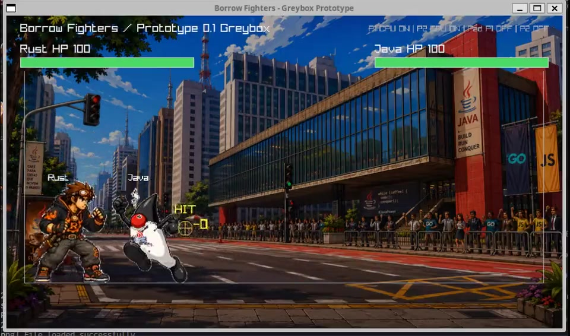

# Borrow Fighters

Jogo 2D de luta com humor de programação, iniciado como um projeto **docs-first** e agora com um protótipo greybox jogável em Rust + Raylib.

Status: **Prototype 0.1 / Greybox jogável / Vertical slice em evolução**

## Objetivo

Este repositório centraliza documentação, governança, assets placeholder e código do primeiro protótipo jogável.

A ideia continua sendo evoluir com decisões explícitas, escopo controlado e colaboração aberta entre programação, game design e arte.

## Índice central

### Visão e produto

- [`docs/00-vision.md`](docs/00-vision.md): visão do jogo.
- [`docs/01-mini-gdd.md`](docs/01-mini-gdd.md): Mini-GDD inicial.
- [`docs/02-prototype-scope.md`](docs/02-prototype-scope.md): escopo do primeiro protótipo.
- [`docs/03-backlog.md`](docs/03-backlog.md): backlog inicial e t-shirt sizing.
- [`docs/04-team-briefing.md`](docs/04-team-briefing.md): briefing para reunir colaboradores.
- [`docs/10-greybox-playtest.md`](docs/10-greybox-playtest.md): como testar o primeiro protótipo greybox.
- [`docs/12-worldbuilding.md`](docs/12-worldbuilding.md): história, personagens e arenas brasileiras.

### Governança, contribuição e release

- [`CONTRIBUTING.md`](CONTRIBUTING.md): guia prático para contribuir agora.
- [`docs/05-governance.md`](docs/05-governance.md): regras de PR, branches, labels, papéis, squads e decisões.
- [`docs/06-release-process.md`](docs/06-release-process.md): sistema de release, tags, milestones e checklist.
- [`CHANGELOG.md`](CHANGELOG.md): histórico de mudanças relevantes.

### Arte, mood e moldes

- [`docs/07-art-direction.md`](docs/07-art-direction.md): direção de arte inicial, moods e critérios visuais.
- [`docs/11-sprite-pipeline.md`](docs/11-sprite-pipeline.md): formato candidato para atlas, animações, pivots e metadata de sprites.
- [`docs/16-sprite-combat-viewer-roadmap.md`](docs/16-sprite-combat-viewer-roadmap.md): roadmap do viewer para artistas conferirem atlas, pivot, grade e boxes.
- [`docs/17-visual-scale-and-stage-metrics.md`](docs/17-visual-scale-and-stage-metrics.md): escala visual alvo de personagens, arena e workflow de calibracao.
- [`docs/18-sprite-studio.md`](docs/18-sprite-studio.md): ferramenta Tauri + React para editar manifestos e atlas fora do loop do jogo.
- [`docs/templates/mood-proposal.md`](docs/templates/mood-proposal.md): molde para proposta de moodboard.
- [`docs/templates/character-concept.md`](docs/templates/character-concept.md): molde para personagem e mecânica.
- [`docs/templates/adr-template.md`](docs/templates/adr-template.md): molde para novas decisões.
- [`docs/templates/release-checklist.md`](docs/templates/release-checklist.md): checklist de release.

### Código e IA

- [`docs/08-code-architecture.md`](docs/08-code-architecture.md): esboço da arquitetura Rust + Raylib.
- [`docs/11-sprite-pipeline.md`](docs/11-sprite-pipeline.md): ponte entre assets de artistas e futuro motor de sprites.
- [`docs/12-technical-combat-guide.md`](docs/12-technical-combat-guide.md): guia técnico de combate, hitbox/hurtbox, Combat Lab e rastreio de código.
- [`docs/13-combat-design-roadmap.md`](docs/13-combat-design-roadmap.md): plano técnico para golpes, balanceamento e Combat Lab.
- [`docs/14-audio-pipeline.md`](docs/14-audio-pipeline.md): motor de áudio por eventos, manifesto JSON e convenções de clips.
- [`docs/15-character-combat-matrix.md`](docs/15-character-combat-matrix.md): matriz de identidade mecânica e tuning inicial de Rust, Duke, Go e C.
- [`docs/16-sprite-combat-viewer-roadmap.md`](docs/16-sprite-combat-viewer-roadmap.md): ferramenta isolada para inspecionar sprites e preparar hitbox/hurtbox data-driven.
- [`docs/17-visual-scale-and-stage-metrics.md`](docs/17-visual-scale-and-stage-metrics.md): padrao tecnico de tamanho em tela, escala de sprite e largura de arena.
- [`docs/18-sprite-studio.md`](docs/18-sprite-studio.md): app desktop externo para artistas editarem `*.sprite.json` com UI propria.
- [`docs/09-ai-collaboration.md`](docs/09-ai-collaboration.md): como Codex, Claude e skills devem navegar o projeto.
- [`AGENTS.md`](AGENTS.md): instruções persistentes para Codex.
- [`CLAUDE.md`](CLAUDE.md): instruções persistentes para Claude Code.
- [`.agents/skills/`](.agents/skills): skills repo-local para Codex.
- [`.claude/skills/`](.claude/skills): skills de projeto para Claude Code.

### Decisões registradas

- [`docs/adr/0001-stack-rust-raylib.md`](docs/adr/0001-stack-rust-raylib.md): decisão inicial de stack.
- [`docs/adr/0002-version-control-workflow.md`](docs/adr/0002-version-control-workflow.md): fluxo de branches, PRs e commits.
- [`docs/adr/0003-code-architecture-rust-raylib.md`](docs/adr/0003-code-architecture-rust-raylib.md): arquitetura inicial de código Rust + Raylib.
- [`docs/adr/0004-runtime-feature-flags-and-preferences.md`](docs/adr/0004-runtime-feature-flags-and-preferences.md): feature flags runtime e tela de preferências.
- [`docs/adr/0005-data-driven-audio-events.md`](docs/adr/0005-data-driven-audio-events.md): eventos de áudio data-driven com manifesto JSON.
- [`docs/adr/0006-runtime-sprite-scale-and-scene-state.md`](docs/adr/0006-runtime-sprite-scale-and-scene-state.md): escala visual por manifesto e maquina de estados de cenas.
- [`docs/adr/0007-sprite-frame-combat-runtime.md`](docs/adr/0007-sprite-frame-combat-runtime.md): metadata de hitbox/hurtbox por frame no runtime.
- [`docs/adr/0008-external-sprite-studio-tooling.md`](docs/adr/0008-external-sprite-studio-tooling.md): Sprite Studio externo em Tauri + React, isolado do codigo do jogo.

### GitHub

- [`.github/PULL_REQUEST_TEMPLATE.md`](.github/PULL_REQUEST_TEMPLATE.md): template padrão de PR.
- [`.github/ISSUE_TEMPLATE/`](.github/ISSUE_TEMPLATE): templates de issues.
- [`.github/CODEOWNERS`](.github/CODEOWNERS): molde de donos de código/docs/assets.
- [`.github/release.yml`](.github/release.yml): categorias de release notes.
- [`.github/workflows/docs-check.yml`](.github/workflows/docs-check.yml): validação leve de docs e YAML.
- [`.github/workflows/pr-title.yml`](.github/workflows/pr-title.yml): validação de título de PR como Conventional Commit.
- [`.github/workflows/rust-check.yml`](.github/workflows/rust-check.yml): validação Rust com fmt, testes e clippy.

## Nome provisório

**Borrow Fighters** é um working title. O nome pode mudar conforme identidade visual, escopo e tom do jogo evoluírem.

## Amostra atual

[](assets/showcase/prototype-0.1-greybox.mp4)

_Clique na imagem para abrir o clipe sem áudio. Os sprites, VFX e cenário ainda são placeholders de protótipo: servem como mood, escala e teste de leitura visual, não como alvo final de polimento._

## Como contribuir

Leia primeiro:

1. [`docs/00-vision.md`](docs/00-vision.md)
2. [`docs/01-mini-gdd.md`](docs/01-mini-gdd.md)
3. [`docs/03-backlog.md`](docs/03-backlog.md)
4. [`CONTRIBUTING.md`](CONTRIBUTING.md)
5. [`docs/05-governance.md`](docs/05-governance.md)

O documento [`docs/03-backlog.md`](docs/03-backlog.md) e a fonte de verdade dos proximos passos. Ele mantem a tabela **Agora / Proximo / Depois** e deve ser atualizado quando uma frente ativa muda, conclui ou entra no fluxo de PR.

Neste estágio, contribuições devem focar em:

1. clareza da visão;
2. redução de escopo;
3. mecânica central de luta;
4. identidade dos personagens;
5. sprites, animações, cenários e feedback visual;
6. decisões técnicas reversíveis.

## Como o GitHub deve ser usado

- Ideias pequenas entram como issue.
- Mudanças de documentação, processo, arte ou decisão entram por PR.
- Decisões estruturais entram como ADR.
- Milestones agrupam escopo de release.
- `main` deve ser protegida no GitHub antes do primeiro trabalho colaborativo real.

As regras propostas estão em [`docs/05-governance.md`](docs/05-governance.md).

## Rodando o protótipo greybox

O código jogável atual implementa um greybox local para validar o básico: menu principal com submenus de versus, treino e opções, arenas brasileiras em rotação começando pelo Sirius e trocando apenas no início da próxima luta, intro cinematográfica com contagem `11` / `10` / `01` / `Fight!`, personagens com spritesheet placeholder, movimento, pulo diagonal, abaixar, defesa, soco fraco, soco forte, chute, varredura, overhead, anti-air, agarrão curto, ataques aéreos, fireball, primeira identidade mecânica de Rust/Duke/Go por frame data, C como novo atlas jogável ainda em tuning genérico, CPU de playtest para um ou dois jogadores, colisão corpo-corpo, hitbox/hurtbox opcional, dano, stun, pushback, whiff recovery, vida, vitória e restart.

O runtime também já está preparado para áudio por eventos. O manifesto fica em [`assets/audio/audio_manifest.json`](assets/audio/audio_manifest.json), e o guia técnico fica em [`docs/14-audio-pipeline.md`](docs/14-audio-pipeline.md). O pacote inicial inclui SFX/UI/vozes de anúncio, contagem pré-luta e música de menu/combate com fontes CC0 registradas em [`assets/audio/ATTRIBUTION.md`](assets/audio/ATTRIBUTION.md).

Requisitos iniciais:

- Rust estável.
- Dependências nativas exigidas por Raylib/raylib-rs no sistema operacional.

Comandos:

```bash
cargo run
cargo run -- --fight --p1 go --p2 duke
cargo run -- --player-one rust --player-two go
cargo run -- --fight --p1 c --p2 rust
```

O jogo abre primeiro no menu principal. Use `Setas` ou `W/S` para navegar, `Enter` ou `Espaço` para confirmar, `A/D` ou `←`/`→` para trocar personagem no submenu `Versus Setup`, e `Esc` para voltar de submenus, luta, Combat Lab ou Sprite Viewer. `Esc` não fecha mais a janela; para sair, use `Exit` ou o botão de fechar da janela.

O menu principal mantém a primeira tela simples:

- `Quick Fight`: inicia a luta com a configuração atual.
- `Versus Setup`: escolhe Player 1 e Player 2.
- `Training`: abre `Combat Lab` ou `Sprite Viewer`.
- `Options`: liga/desliga gravação local e feature flags de protótipo.

Ao iniciar uma luta, o jogo roda a entrada dos personagens e depois bloqueia input durante a contagem central `11`, `10`, `01`, `Fight!`. A arena só avança para a próxima rotação quando uma nova luta é iniciada depois de uma vitória, para preservar a pose final no mesmo cenário.

Por padrão, a luta normal inicia `Rust` contra `Duke / Java`. O submenu `Versus Setup` permite ciclar Player 1 e Player 2 entre Rust, Duke, Go e C. Para testar matchups direto por CLI, use `--p1`/`--player-one` e `--p2`/`--player-two` com `rust`, `duke`, `java`, `go`, `golang`, `gopher`, `c`, `langc`, `c-lang` ou `clang`. Adicione `--fight` ou `--skip-menu` para entrar direto na luta sem passar pelo menu. Go já possui atlas placeholder próprio para luta, entrada cinematográfica e projectile, além de vida, loadout e frame data próprios. C já possui atlas, entrada e projectile extraídos dos arquivos de referência com chroma key, mas ainda usa loadout genérico até receber identidade mecânica própria.

Para abrir o laboratório de combate direto em uma cena limpa:

```bash
cargo run -- --lab combat --character rust --move light_punch
cargo run -- --lab combat --character duke --move projectile
cargo run -- --lab combat --character rust --move sweep
cargo run -- --lab combat --character duke --move throw
cargo run -- --lab combat --character go --move kick
cargo run -- --lab combat --character c --move projectile
cargo run -- --lab combat --character rust --pose block
```

No Combat Lab, use `Tab` / `Shift+Tab` para alternar golpe, `PageDown` / `PageUp` para alternar pose, `Enter` para repetir, `Espaço` para pausar, `.` para avançar 1 frame quando pausado, `Home` para voltar ao frame 0, `H` para hurtbox, `B` para hitbox, `P` para pivot/eixos, `D` para dummy de contato, `A` para mostrar/esconder o fundo de arena e `Esc` para voltar ao menu quando aberto pelo submenu `Training`. O overlay mostra frame data, vantagem estimada, pushback, whiff recovery e distância após pushback. Valores aceitos em `--character`: `rust`, `rustacean`, `duke`, `java`, `go`, `golang`, `gopher`, `c`, `langc`, `c-lang` ou `clang`. Valores aceitos em `--move`: `light_punch`, `heavy_punch`, `kick`, `sweep`, `overhead`, `anti_air`, `air_punch`, `air_kick`, `throw` e `projectile`. Valores aceitos em `--pose`: `move`, `idle`, `crouch`, `jump`, `block`, `hit` e `victory`.

Para abrir o viewer de sprites direto em uma ferramenta isolada:

```bash
cargo run -- --tool sprite-viewer --manifest assets/placeholder/rust-fighter.sprite.json --clip idle
cargo run -- --tool sprite-viewer --manifest assets/placeholder/duke-fighter.sprite.json --clip special --character duke --move projectile
cargo run -- --tool sprite-viewer --manifest assets/placeholder/c-fighter.sprite.json --clip special --character c --move projectile
```

No Sprite Combat Viewer, use o mouse para inspecionar coordenadas locais do frame, arrastar personagem/dummy e ajustar alças de `frames[].combat`. `N` gera um rascunho de metadata a partir do overlay runtime do golpe selecionado, `Tab` / `Shift+Tab` alterna clip, `Enter` sincroniza clip com golpe, `C` / `Shift+C` alterna personagem de combate, `[` / `]` alterna golpe, `.` / `,` avança ou volta frame, `Espaço` pausa, mouse wheel controla zoom, `0` reseta zoom, `=` / `-` ajusta `scale`, `Setas` ou `Shift+Setas` move o `pivot`, `Ctrl+Setas` ajusta largura/altura do corpo físico, `Ctrl+Shift+Setas` ajusta altura abaixada, `Ctrl+S` salva manifestos de tuning, `O` mostra/esconde dummy, `M` mostra/esconde boxes de combate, `T` mostra/esconde trajetória prevista do projectile, `F5` recarrega manifesto/atlas, `F12` salva screenshot em `target/sprite-viewer-capture.png`, `F9`/`F10` gravam um MP4 local, `G` alterna grade, `P` alterna pivot, `B` alterna bounds, `R` reseta posição e `Esc` volta ao menu quando aberto por `Training`. O padrão de escala fica em [`docs/17-visual-scale-and-stage-metrics.md`](docs/17-visual-scale-and-stage-metrics.md), e o roadmap completo fica em [`docs/16-sprite-combat-viewer-roadmap.md`](docs/16-sprite-combat-viewer-roadmap.md).

O novo Sprite Studio externo vive em `tools/sprite-studio` e deve substituir o viewer Raylib em uma limpeza propria:

```bash
cd tools/sprite-studio
pnpm install
pnpm build
pnpm tauri dev
```

Ele usa Tauri 1.8 + React, edita `*.sprite.json` por UI propria, possui file picker nativo, menu desktop, timeline, paineis colapsaveis, tutorial visual, autosave/backup, snap, guias de escala, presets de combat boxes, validacao do runtime e export de review. Detalhes e pre-requisitos ficam em [`docs/18-sprite-studio.md`](docs/18-sprite-studio.md).

Configurações disponíveis em `Versus Setup` e `Options`:

| Preferência | Padrão | Efeito |
|---|---|---|
| Personagem Player 1 | Rust | Define o personagem do Player 1 na próxima luta. |
| Personagem Player 2 | Duke / Java | Define o personagem do Player 2 na próxima luta. |
| Player 1 usa IA | Desligado | Controla o Player 1 automaticamente. |
| Player 2 usa IA | Ligado | Controla o Player 2 automaticamente. |
| IA pode dar golpes | Ligado | Quando desligado, a IA ainda anda, pula, afasta, aproxima e defende, mas não ataca. |
| Player 1 recebe dano | Ligado | Quando desligado, o Player 1 fica invencível para playtest. |
| Player 2 recebe dano | Ligado | Quando desligado, o Player 2 fica invencível para playtest. |
| Mostrar HUD | Ligado | Exibe vida, título e status no topo. |
| Mostrar ajuda de controles | Desligado | Exibe comandos no rodapé durante a luta. |
| Mostrar debug de combate | Desligado | Exibe hitboxes, hurtboxes, labels e colisão corpo-corpo. |
| Entrada por gamepad | Ligado | Usa controles detectados pelo Raylib quando disponíveis. |

Controles:

| Ação | Rust / Player 1 | Java / Player 2 | Gamepad Xbox |
|---|---|---|---|
| Mover | `A` / `D` | `←` / `→` ou `J` / `L` | Left stick ou D-pad |
| Pular | `W` | `↑` ou `I` | `A` |
| Abaixar | `S` | `↓` ou `K` | Left stick para baixo ou D-pad baixo |
| Defender | `Q` | `U` | `LB` ou `LT` |
| Soco fraco / curto | `F` | `O` ou `Enter` | `X` |
| Soco forte / longo | `H` | `P` ou `Right Shift` | `Y` |
| Chute | `V` | `;` ou `/` | `B` |
| Varredura baixa | `S` + `V` | `↓`/`K` + `;`/`/` | Baixo + `B` |
| Anti-air | `S` + `H` | `↓`/`K` + `P`/`Right Shift` | Baixo + `Y` |
| Overhead | Frente + `H` | Frente + `P`/`Right Shift` | Frente + `Y` |
| Agarrão curto | `Q` + `F` | `U` + `O`/`Enter` | `LB`/`LT` + `X` |
| Ataque aéreo | No ar: `F` ou `V` | No ar: `O`/`Enter` ou `;`/`/` | No ar: `X` ou `B` |
| Fireball | `G` | `Right Ctrl` ou `KP0` | `RB` |
| Alternar P2 CPU/manual | `C` | `C` | `View` |
| Reiniciar | `R` | `R` | `Menu` |
| Gravar captura local | `F9` inicia / `F10` para | `F9` / `F10` | - |

O primeiro gamepad conectado controla o Player 1 quando a IA do Player 1 estiver desligada. O segundo gamepad controla o Player 2 quando a IA do Player 2 estiver desligada. O Player 2 começa em modo CPU; use `C` ou `View` para alternar CPU/manual do Player 2 durante a luta.

Quando ambos os jogadores usam IA, Rust e Java usam perfis diferentes para evitar movimentos espelhados: um tende a jogar mais em média distância e o outro pressiona mais de perto. A IA anda, pula, bloqueia, soca, chuta, tenta varredura, overhead, anti-air, agarrão curto, ataque aéreo e especial, mas ainda é determinística e serve para playtest, não para desafio competitivo.

Captura local: `F9` inicia uma gravação MP4 do framebuffer do jogo com áudio e `F10` para/salva em `captures/`. O submenu `Options` também tem a linha `Local Recording`, útil quando o ambiente captura mal teclas de função. O corte atual envia frames brutos do Raylib para `ffmpeg` e usa PulseAudio para áudio; no WSLg o áudio padrão é `RDPSink.monitor`. Se a fonte de áudio local tiver outro nome, rode com `BORROW_FIGHTERS_CAPTURE_AUDIO_SOURCE=<fonte> cargo run`.

O HUD mostra `Pad P1` e `P2` como `ON` quando Raylib detecta o controle. Se um controle Bluetooth estiver pareado mas aparecer `OFF`, confirme se o sistema que executa `cargo run` expõe joystick/gamepad para o Raylib. Em WSL ou ambiente remoto, pode ser necessário testar no host nativo ou encaminhar o dispositivo.

Assets placeholder:

- [`assets/placeholder/arena-sirius.png`](assets/placeholder/arena-sirius.png): arena inicial atual.
- [`assets/placeholder/arena-fortaleza.png`](assets/placeholder/arena-fortaleza.png): arena de rotação.
- [`assets/placeholder/arena-java-street.png`](assets/placeholder/arena-java-street.png): arena de rotação.
- [`assets/placeholder/fighter-greybox-spritesheet.png`](assets/placeholder/fighter-greybox-spritesheet.png): poses simples de lutador para testar leitura de movimento e golpes sem debug visual.
- [`assets/placeholder/c-fighter-atlas.png`](assets/placeholder/c-fighter-atlas.png): atlas placeholder jogável do C.
- [`assets/placeholder/c-start-atlas.png`](assets/placeholder/c-start-atlas.png): entrada cinematográfica placeholder do C.
- [`assets/placeholder/c-bitstream-projectile.png`](assets/placeholder/c-bitstream-projectile.png): projectile placeholder do C com `0` e `1` legíveis.

Guia completo de teste: [`docs/10-greybox-playtest.md`](docs/10-greybox-playtest.md).
