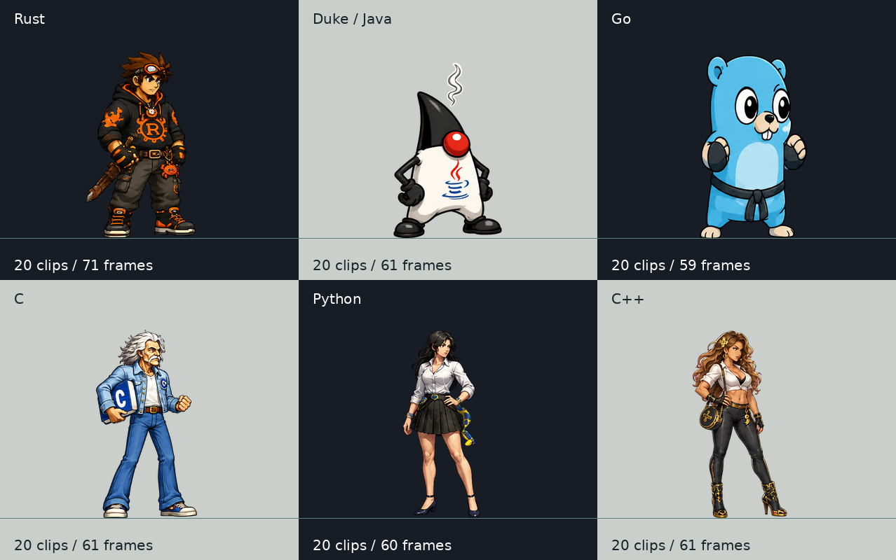

# Candidatos de arte — Borrow Fighters

Seis personagens, **120 animações próprias**, PNGs com alpha real e metadados explícitos. Os originais continuam em `assets/placeholder/`. Os novos assets são candidatos com ressalvas registradas; não receberam aprovação artística final.



| Personagem | Clips / quadros | Panorama | Animação de exemplo | Laudo |
|---|---:|---|---|---|
| Rust | 20 / 71 | [Imagens](rust/review/overview.png) | [Caminhada](rust/review/walk.gif) | [Revisão](../production/rust/review.md) |
| Duke / Java | 20 / 61 | [Imagens](duke/review/overview.png) | [Especial](duke/review/special.gif) | [Revisão](../production/duke/review.md) |
| Go | 20 / 59 | [Imagens](go/review/overview.png) | [Salto](go/review/jump.gif) | [Revisão](../production/go/VERIFICATION.md) |
| C | 20 / 61 | [Imagens](c/review/overview.png) | [Guarda baixa](c/review/crouch_block.gif) | [Revisão](../production/c/review.md) |
| Python | 20 / 60 | [Imagens](python/review/overview.png) | [Soco](python/review/punch_light.gif) | [Revisão](../production/python/review.md) |
| C++ | 20 / 61 | [Imagens](cpp/review/overview.png) | [Especial](cpp/review/special.gif) | [Revisão](../production/cpp/review.md) |

Cada pasta `review/` contém 20 GIFs e 20 painéis quadro a quadro, com escala/pivô/duração do manifesto. Os GIFs mostram as duas orientações em fundos claro e escuro; a pausa extra no último quadro é só para revisão. Os seis personagens têm vídeos da simulação real em `review/runtime-motion/`. Há também [resultados de partidas nativas](runtime-matches/README.md); a cobertura exata está na [matriz](../../docs/19-sprite-production-coverage.md).

Cinco projéteis foram reaproveitados. O [data stream de Python](python/python-projectile.png) é novo e separado: corrige a textura original que continha a personagem caída. Colisões, origem, velocidade e dano foram preservados.

Para abrir os candidatos:

```bash
BORROW_FIGHTERS_SPRITE_CANDIDATES=1 cargo run -- --fight --p1 python --p2 cpp
BORROW_FIGHTERS_SPRITE_CANDIDATES=1 cargo run -- --lab combat --character rust --move light_punch
```

O opt-in mantém o fallback quando um atlas ou projétil candidato estiver ausente/inválido. A [produção por ação](../production/README.md) preserva referências, fontes, prompts e revisões rejeitadas. Nenhum placeholder foi sobrescrito.
