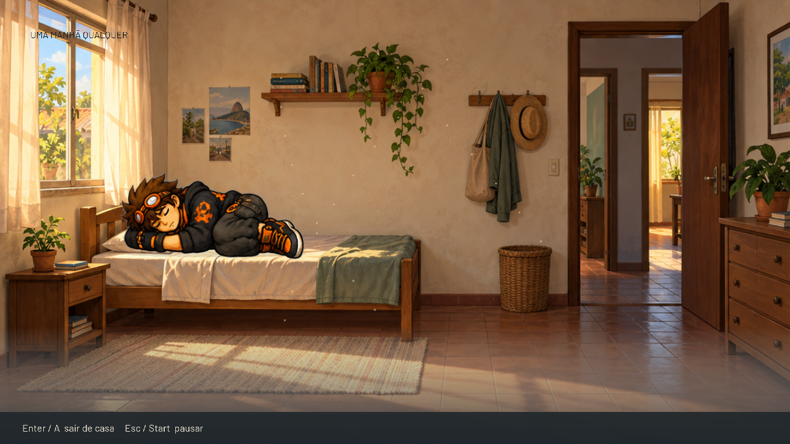
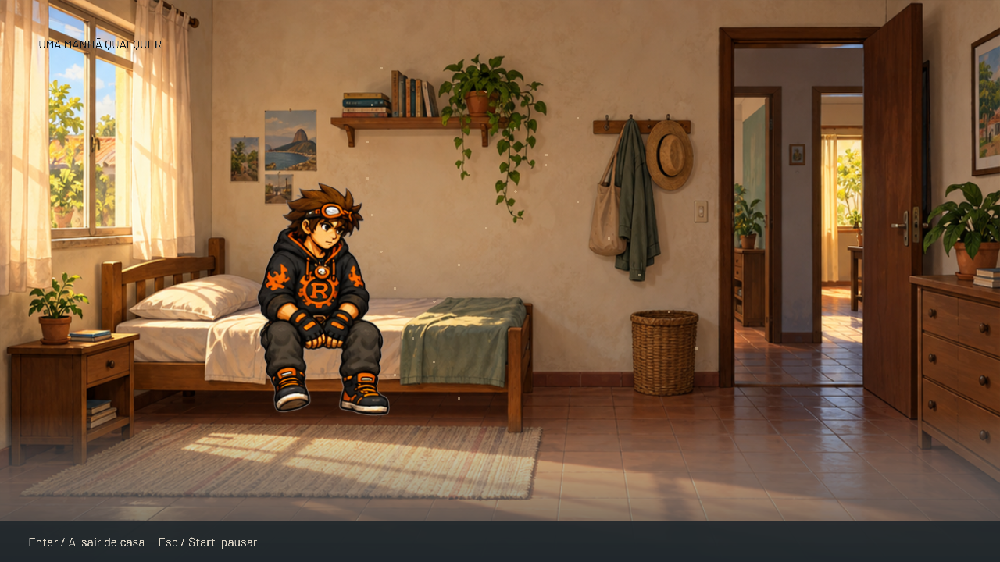
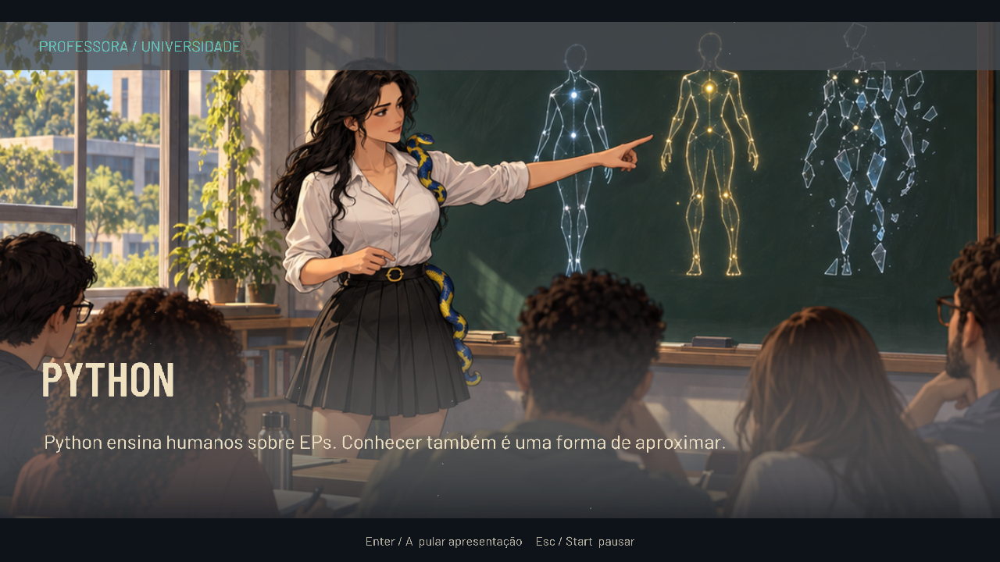
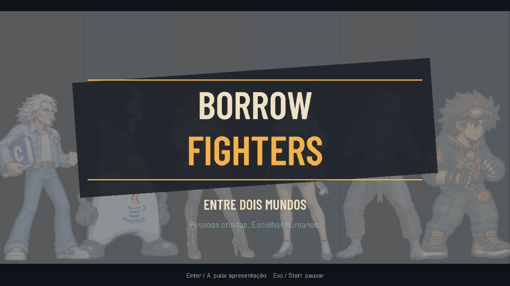

# Textos editáveis, manhã corrigida e apresentação

Entrega verificada em 10 de setembro de 2026 na branch
`feature/rust-adventure-prologue`, a partir de `6f911ec`.
[Escopo](../../28-adventure-texts-and-opening.md) e
[diário](../../worklogs/rust-adventure-prologue.md).

## Vídeos

- [Apresentação — 48 segundos](opening.mp4): jornais, C++, Python, Duke, Old C,
  Go, Rust, logo girando e subtítulo.
- [Manhã corrigida — 14 segundos](morning.mp4): apoios no colchão, ao sentar,
  espreguiçar e levantar.
- [Sequência completa — 122,467 segundos](full-sequence.mp4): Ada → manhã →
  combate → pesar → apresentação → conclusão.

Os excertos têm 1.440 e 420 quadros de vídeo a 30 fps; o padding AAC acrescenta
aproximadamente 0,047 s ao contêiner. [Metadados dos cortes](excerpts.json).










## Editar e experimentar

Edite [pt-BR.json](../../../assets/adventure/texts/pt-BR.json), salve e pressione
**F5** na janela. Nenhuma compilação é necessária. Terminal, legendas, interface,
manchetes, biografias, nomes e subtítulo vêm desse arquivo.
[Guia de edição e chaves](../../../assets/adventure/texts/README.md).

```sh
cargo run --no-default-features --features adventure --bin borrow-adventure
# Entrada direta para revisar a apresentação:
target/debug/borrow-adventure --start opening
# Arquivo de textos alternativo:
target/debug/borrow-adventure --texts /caminho/meus-textos.json
```

A apresentação entra depois da vitória e do pesar. `Enter/A` pula a montagem;
`Esc/Start` pausa. Na conclusão, `T/X` repete a apresentação, `Enter/Y` recomeça
a história e `R/A` repete o encontro. A entrada direta é uma ferramenta de revisão
e não fabrica uma vitória no estado do combate.

## Verificação observada

O [relatório nativo](native/native-checks.json) registra **26 checks aprovados**,
incluindo todos os 14 anteriores. Um catálogo temporário recebeu a frase
“MANHÃ DE AÇÃO — CORAÇÃO E CAFÉ”; F5 alterou a tela no mesmo processo.
O hash do binário não mudou. JSON inválido conservou a revisão e os pixels do
texto; restaurar o catálogo válido mudou a tela novamente. O arquivo original
do repositório permaneceu intacto durante o teste.

[Captura do texto editado](native/screenshots/01a-external-text-accented.png),
[JSON usado](native/texts-edited-valid.json),
[gravação da janela](native/adventure-silent.mp4),
[resultado](native/result.json) e [telemetria](native/telemetry.jsonl.gz).
O vídeo nativo tem 46,967 s e diferença de 0,0032 s para a telemetria; processo
encerrou com código 0, sem erros X11. O script enviou eventos somente à janela
do processo criado. Foram conferidos derrota/retry, J/K/Q, seis contatos,
seis defesas, pesar, pausa da montagem, retomada sem skip e replay por T.

O [smoke de isolamento](isolation/isolation-checks.json) abriu o binário com
cwd externo e uma raiz de assets contendo somente `adventure/`. Foram observados
30 caminhos exclusivos: catálogo, ilustrações, fontes, cinco músicas e quatro
efeitos. Áudio e janela inicializaram e fecharam; código de saída 0.
[Rastreamento](isolation/assets-only.strace) e [log](isolation/game.log).

| Verificação | Resultado |
|---|---|
| Ambos os jogos, todos os targets | 417 testes |
| Luta sem aventura | 393 testes |
| Aventura sem luta | 27 testes, incluindo 3 do core |
| Core sem modos | 3 testes |
| Fmt e Clippy estrito | Aprovados |
| Checker de fronteiras | Aprovado; 34 fixtures |
| Mixer de revisão | 28 testes |

[Comandos e resultados](verification.json).

## Arte, áudio e limites

A manhã usa os mesmos desenhos, com âncoras anatômicas por pose e respiração
em torno do apoio. A correção não adiciona desenhos intermediários. A montagem
usa câmera, jornais em movimento, poses do elenco, quatro quadros biográficos
novos e logo tipográfico rotativo. Os quadros de C++/Python foram produzidos
com `image_gen` integrado; imagens originais, fontes e prompts estão na
[procedência](../../../assets/adventure/opening/ART-PROVENANCE.md).

A trilha é uma composição procedural original de 48 s, com resolução musical
na entrada do logo aos 41 s. [Gerador e origem](../../../assets/adventure/audio/README.md).
O áudio dos vídeos foi **reconstruído a partir da telemetria** usando os WAVs
do jogo; não foi gravado do dispositivo. O [relatório](mix-review.json) registra
ausência de clipping e vídeo preservado no mux completo.
[Progressão](review-result.json) e [telemetria completa](telemetry.jsonl.gz).

Ambiente: Linux/WSL, X11, OpenGL/D3D12 sobre NVIDIA GeForce RTX 4070 Laptop GPU.
Entrada sintética dirigida à janela não equivale a teste de gamepad físico.
Ritmo, fluidez e audição humana permanecem no TODO-013; o smoke de áudio apenas
confirma inicialização e carregamento. Logs versionados removem somente espaços
finais das linhas. A evidência anterior permanece como histórico da primeira
entrega, antes da correção da cama e da apresentação.
