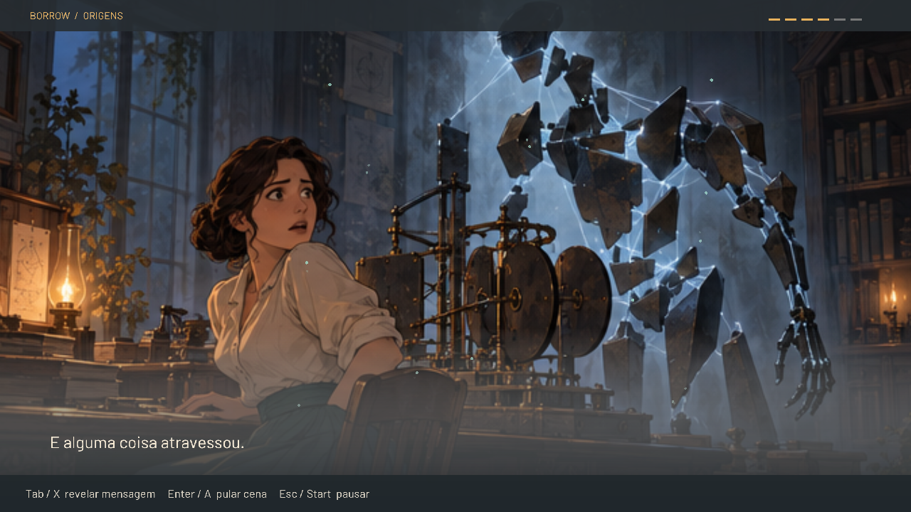
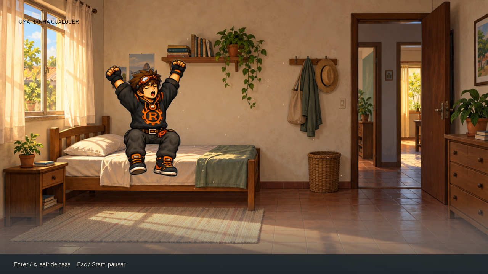
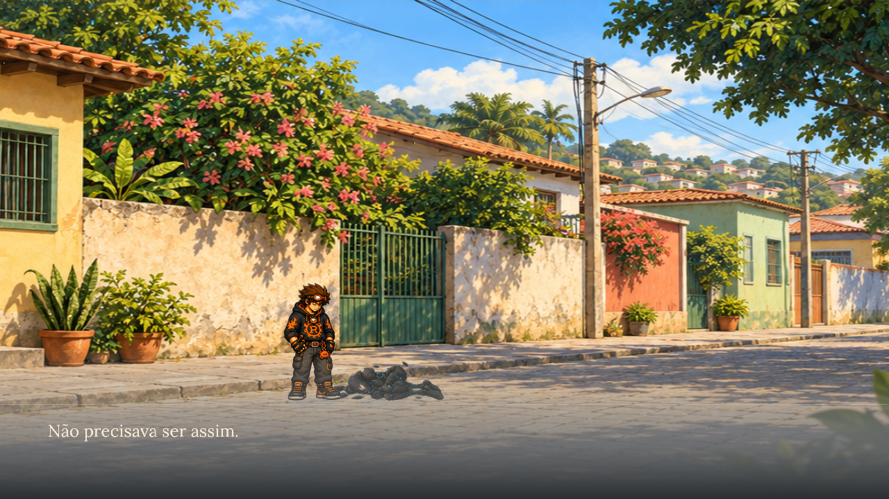

# Aventura — Ada, a manhã de Rust e o primeiro encontro

Registro histórico do primeiro corte. A [revisão posterior](../adventure-opening/README.md)
corrige a cama, adiciona texto editável e apresenta o universo após o encontro.

Experimento implementado e verificado em 10 de setembro de 2026, na branch
`feature/rust-adventure-prologue`. [Escopo e lore](../../27-rust-story-adventure.md),
[isolamento](../../adr/0021-isolated-adventure-experiment.md) e
[diário de retomada](../../worklogs/rust-adventure-prologue.md).

## Assistir e jogar

[Vídeo completo com áudio — 74,467 s](adventure.mp4).







```sh
cargo run --no-default-features --features adventure --bin borrow-adventure
```

O episódio contém o prólogo de Ada com mensagem digitada, despertar de Assembly,
salto temporal, manhã de Rust, encontro manual e gesto de pesar. Abertura de
aproximadamente 54 segundos; a duração do encontro depende do jogador. A cena
final dura cerca de sete segundos. Ada usa quadros ilustrados com transições,
câmera e partículas; Rust e a errática usam poses próprias temporizadas.

`A/D` ou setas movem; `Espaço/W` pula; `J/F` ataca; `K/H` golpe forte;
`Q/L` defende. `Enter` pula a cena atual; `Tab` revela o texto; `Esc` pausa.
`R` recomeça o encontro após derrota/conclusão. `F3` mostra caixas e `F12` captura.
No controle: direcional/analógico, `A`, `X/Y`, `LB`, `Start`; botões contextuais
de continuação e replay aparecem na interface.

## Evidência de execução

O vídeo completo foi capturado do renderer Raylib com comandos simulados que
usam as mesmas regras de contato do jogo. O [resultado](review-result.json)
registra a progressão e vitória; a [telemetria comprimida](telemetry.jsonl.gz)
preserva os estados observados. O encontro não é uma vitória roteirizada no
binário normal: ataques podem falhar, Rust pode morrer e a história aguarda
vitória efetiva.

O áudio do vídeo foi **reconstruído da telemetria**, com os oito WAVs originais
usados pelo jogo, sem capturar o dispositivo de som. O [relatório](mix-review.json)
registra quatro trilhas, 15 cues, pausa silenciosa de 0,5 s, ausência de clipping
e preservação integral do bitstream H.264. A aplicação também possui reprodução
ao vivo com pausa/retomada; este vídeo não comprova a saída do dispositivo.

A [gravação por entrada na janela](native/adventure-silent.mp4) testa o caminho
real de input, sem política automática dentro do jogo. Os
[14 checks](native/native-checks.json) passaram: pausa, retomada sem pular cena,
movimento, pulo, derrota, retry, golpes leve/forte, defesa, vitória e pesar.
O MP4 H.264 tem 1280×720, 30 fps e 40,867 s, com diferença de 0,030 s em relação
à telemetria. [Resultado](native/result.json),
[telemetria](native/telemetry.jsonl.gz) e [log gráfico](native/game.log).
Os logs versionados removem somente espaços ao final das linhas.

Ambiente: Linux/WSL, X11, OpenGL 3.3, renderer D3D12 sobre NVIDIA GeForce RTX
4070 Laptop GPU. O script enviou eventos sintéticos exclusivamente à janela do
processo criado, sem capturar desktop nem alterar foco de outras aplicações.
Controle físico, audição humana e execução nativa Windows não foram validados
nesta rodada. A leitura emocional e a vontade de continuar serão avaliadas no
playtest humano; as verificações técnicas não respondem essas perguntas.

## Verificação automatizada

[Registro dos comandos e resultados](verification.json):

| Verificação | Resultado |
|---|---|
| Fmt e Clippy estrito, todos os targets/features | Aprovados |
| Ambos os jogos | 412 testes |
| Luta sem aventura | 393 testes |
| Aventura sem luta | 22 testes, incluindo 3 do core |
| Core sem nenhum jogo | 3 testes |
| Fronteiras de domínio | Checker aprovado e 34 fixtures |
| Reconstrução do áudio de revisão | 24 testes |

A matriz final de ambos/aventura inclui a regressão do tamanho do buffer RGBA.
A matriz de luta/core foi executada antes dessa correção, que só altera aventura.
Gravações anteriores com buffer inválido foram descartadas como evidência.

O [smoke test de assets isolados](isolation/isolation-checks.json) passou:
o binário da aventura executou com uma raiz contendo somente `adventure/`;
o renderer real da luta, via `capture_ui_review`, produziu oito telas com a
raiz contendo os demais assets e sem `adventure/`. Ambos saíram com código 0.
O rastreamento de arquivos observou 10 caminhos na aventura e 82 na luta,
sem acesso cruzado. Os dois binários também foram compilados separadamente.

Uma execução adicional da aventura com áudio habilitado inicializou e fechou
o dispositivo, carregou quatro streams e quatro efeitos. Os 18 caminhos de
assets observados permaneceram dentro da raiz exclusiva da aventura.
O [log](isolation/adventure-audio.log) comprova inicialização técnica, sem
substituir audição. O smoke da luta não equivale a uma partida manual nova.

## Reproduzir a revisão

É necessário FFmpeg/FFprobe para gravar; jogar normalmente não os exige.
Os diretórios de saída devem ser novos para separar cada execução.

```sh
cargo build --no-default-features --features adventure --bin borrow-adventure
target/debug/borrow-adventure --review /tmp/adventure-review --mute
python3 tools/review/mix_adventure_review_audio.py /tmp/adventure-review
python3 tools/review/capture_adventure_x11.py --help
```

`--review` usa simulação determinística. `--capture DIRETORIO` grava o jogo
controlado por input normal. `--start encounter` permite testar diretamente o
encontro; `--hidden --frames 60` permite um smoke test curto na sessão gráfica.

As imagens novas foram produzidas com `image_gen` integrado. PNGs originais,
referências, metadados de poses e prompts estão na
[procedência da arte](../../../assets/adventure/ART-PROVENANCE.md). As trilhas e
efeitos são procedurais originais, com [gerador reproduzível](../../../assets/adventure/audio/README.md).
