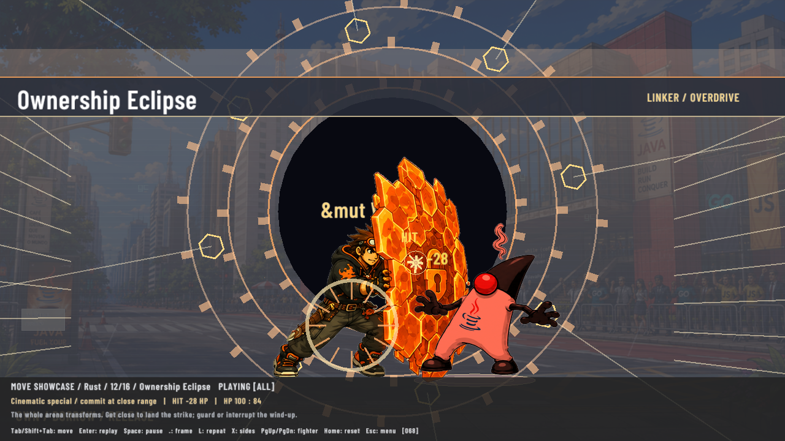

# Revisão de apresentação — 2026-09-08

O [vídeo dos seis cinematográficos](../../../assets/showcase/presentation-polish-2026-09-08.mp4) contém **26 segundos, 1280×720, 60 fps e 1560 frames**, sem áudio. Os primeiros 18 segundos contêm seis trechos de três segundos do `MoveShowcase` real; os golpes acertam por colisão local, sem dano sintético, interpolação de poses ou aceleração da simulação. Os oito segundos finais acompanham uma travessia completa do caramelo e o gesto do cameo em São Paulo, com relógio visual de 6 a 14 segundos e lutadores em idle. O vídeo foi validado com `ffprobe` como H.264/yuv420p. A captura final usa fontes TTF suavizadas e filtragem trilinear nas seis arenas.

## Capturas e resultados

O [relatório JSON](presentation-review.json) registra 12 situações, três fases por situação, orientação, frame de contato, vida do alvo e caixa local. Os 36 PNGs foram exportados diretamente da textura de renderização Raylib. A revisão visual dos **12 quadros ativos** conferiu silhueta, integridade dos atores, identidade de cada efeito, espaço do banner e leitura do impacto nas duas orientações.

| Golpe | Dano observado | Frame de contato no showcase | Ativo: direita / esquerda |
|---|---|---|---|
| Ownership Eclipse | 28 | 66 | [direita](rust-right-active.png) / [esquerda](rust-left-active.png) |
| JVM Overdrive | 32 | 72 | [direita](duke-right-active.png) / [esquerda](duke-left-active.png) |
| Million Goroutines | 25 | 62 | [direita](go-right-active.png) / [esquerda](go-left-active.png) |
| Kernel Panic | 32 | 74 | [direita](c-right-active.png) / [esquerda](c-left-active.png) |
| Event Horizon | 27 | 64 | [direita](python-right-active.png) / [esquerda](python-left-active.png) |
| Template Singularity | 30 | 70 | [direita](cpp-right-active.png) / [esquerda](cpp-left-active.png) |

O tick de contato coincide nas duas orientações. Startup e recovery estão nos arquivos de mesmo prefixo com sufixos `-startup.png` e `-recovery.png`. As poses existentes de assinatura (soco forte para Go) acompanham os novos timings por remapeamento visual de fase. Os efeitos de tela permanecem atrás dos atores; o arco de contato acompanha a região local do atacante.



## Vida dos cenários e interface

São Paulo foi capturada com o mesmo estado de luta e tempos visuais de 9,5 e 35 segundos. O caramelo cruza nos dois sentidos; o cameo e o cartaz ficam no fundo. Desligar `Vida nos cenarios` remove esses elementos sem alterar os lutadores ou o combate.

| Tempo | Camada ligada | Camada desligada |
|---|---|---|
| 9,5s | [caramelo indo e cameo](java-street-095-on.png) | [sem camada](java-street-095-off.png) |
| 35s | [caramelo voltando e cameo](java-street-350-on.png) | [sem camada](java-street-350-off.png) |
| Sirius, 8,4s | [caramelo em movimento](sirius-084-on.png) | [sem camada e sem cão anterior pintado](sirius-084-off.png) |

As outras arenas estão em [Sirius](stages/sirius.png), [Fortaleza](stages/fortaleza.png), [BioTIC](stages/biotic.png), [Porto Digital](stages/porto-digital.png) e [Vale do Pinhão](stages/vale-pinhao.png), com [relatório próprio](stages/stage-review.json).

A [revisão do menu](ui/main.png), [controles](ui/controls.png), [opções](ui/options.png), [HUD](ui/hud.png) e [vitória](ui/victory.png) usa o harness de interface separado. A comparação exata de postura do cameo deve considerar o relógio: ele intercala repouso e gesto, sem repetir o movimento continuamente.

## Reproduzir

Na raiz do repositório, com os assets completos:

```sh
cargo run --example capture_presentation_review -- target/presentation-review target/presentation-review.mp4
cargo run --example capture_ui_review -- target/ui-review
ffprobe -v error -select_streams v:0 -show_entries stream=codec_name,width,height,r_frame_rate,nb_frames,duration -of json target/presentation-review.mp4
```

O exemplo abre uma janela oculta, exige os dois atlas de cenário e os atores carregados, usa metadata baseline de combate, recusa cenários sem contato e não sobrescreve um MP4 existente. Nesta revisão, a execução ocorreu em display Xephyr isolado para preservar o desktop do usuário. O manifesto de [SHA256](SHA256SUMS) identifica as capturas de cena, interface, controles, relatórios e vídeo.

## Controles no App real

O [resultado XTest](controls/result.json) registra **12/12 verificações aprovadas**, com hash do executável e display Xephyr isolado. A execução usou o App final, após suavização das fontes e das arenas:

- `Y` P1 iniciou Ownership Eclipse, aplicou 28 de dano em Java e encerrou o banner: [captura](controls/11-P1-Y-active.png).
- `]` P2 iniciou JVM Overdrive, aplicou 32 de dano em Rust e encerrou o banner: [captura](controls/12-P2-right-bracket-active.png).
- Espaço manteve o contador do showcase imóvel; `.` avançou um frame; `Home` e `Enter` restauraram o mesmo frame pausado. A comparação usa uma máscara compatível com os pixels suavizados do rodapé.
- As opções alternaram os dois jogadores para controle manual e desligaram/religaram a vida de cenário; o fechamento nativo terminou com código zero.

Nenhum gamepad físico foi conectado; `LB+RT` não foi verificado em hardware. A precisão de frame data e caixas é coberta pelos testes determinísticos, separadamente das capturas por tempo de parede.

## Regressões de combate

Os sete testes em [`tests/cinematic_specials.rs`](../../../tests/cinematic_specials.rs) passaram. As matrizes cobrem seis personagens, ambos os lados, metadata/fallback, contato único, duas alturas de guarda, alvo distante sem dano, interrupção por jab sem dano tardio, compromisso de movimento e outros comandos, reset, pause/step, CLI, showcase, sincronização da pose ativa e troca simultânea sem prioridade de jogador.

A integração final aprovou **300 testes Rust** ([log](cargo-test.log)), `cargo fmt --all -- --check`, clippy estrito, Markdown e YAML. O harness de cena e a verificação de controles do App complementam essas regressões; hardware de gamepad permanece fora desta evidência.
