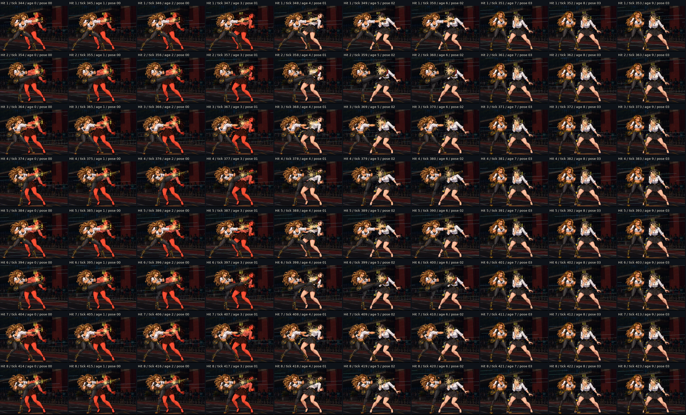

# Python × C++ — reações próprias por contato

[](../../../assets/showcase/python-cpp-reactions-2026-09-09.mp4)

[Vídeo completo com áudio](../../../assets/showcase/python-cpp-reactions-2026-09-09.mp4):
**86,3 segundos, 1280×720, 60 fps**. A rajada começa em **31,3 s**. O renderer
real mostra ambas as personagens em cada situação; o World controla contatos,
reações, deslocamento e recuperação. Captura automática em display Xvfb isolado.

| Trecho | Situações |
|---|---|
| 0–25,08 s | C++ ataca Python: socos, chute, rasteira, overhead, anti-air, golpes aéreos, arremesso, projétil e assinatura. |
| 25,08–36,72 s | Especial cinematográfico de C++, incluindo a rajada em 31,3–32,6 s. |
| 36,72–44,12 s | C++ defende golpes de Python: guarda em pé, overhead, guarda baixa e projétil. |
| 44,12–69 s | Python ataca C++ com os onze golpes comuns/assinatura. |
| 69–78,9 s | Python transforma, engole e devolve C++, que cai e se recupera. |
| 78,9–86,3 s | Python defende as quatro situações equivalentes. |

## O que mudou após o playtest

Os candidatos receberam **oito clips de quatro desenhos por personagem**:
cabeça, corpo, perna, guarda alta, guarda baixa, lançamento, queda e recuperação.
A animação começa no impacto e muda a articulação de braços, pernas, cabeça e
tronco. O renderer usa esses desenhos com uma pequena translação complementar.

Na rajada anterior, cada contato de dez frames reiniciava uma animação ajustada
ao stun de 24 frames. Agora a resposta visual completa ocupa nove frames e
reinicia a cada pancada, sem mudar o stun físico. Os punhos/pés da arte ofensiva
atingem a faixa de rosto/pescoço; o chute frontal também usa `reaction_head`.
A tentativa de usar `reaction_body` nesse chute parecia uma esquiva e foi
corrigida na revisão em combate. Socos leves comuns acertam o tronco e usam Body.



Cada linha acima contém os dez frames entre um contato e o seguinte. São
recortes do MP4, apenas reduzidos e dispostos com rótulos de tick/idade/pose;
nenhuma pose ou efeito foi retocado. O [laudo das janelas](contact-window-review.json)
confirma o reinício no tick do dano e as quatro poses em cada uma das oito
pancadas, nas duas direções. O fim da linha segura a recuperação até o próximo
contato; não entra em idle no meio da rajada.

## Amostras de ambas as defensoras

| Perfil | Python recebe C++ | C++ recebe Python |
|---|---|---|
| Corpo | [Impacto](python-body.png) / [outro lado](python-body-left.png) | [Impacto](cpp-body.png) / [outro lado](cpp-body-left.png) |
| Cabeça | [Overhead](python-head.png) | [Overhead](cpp-head.png) |
| Baixo | [Perna cede](python-low.png) | [Perna cede](cpp-low.png) |
| Guarda alta | [Absorção](python-guard-high.png) | [Absorção](cpp-guard-high.png) |
| Guarda baixa | [Absorção](python-guard-low.png) | [Absorção](cpp-guard-low.png) |
| Lançamento | [Voo](python-launch.png) | [Voo](cpp-launch.png) |
| Queda | [Apoio no chão](python-fall.png) | [Apoio no chão](cpp-fall.png) |
| Recuperação | [Última pose](python-rise.png) / [outro lado](python-rise-left.png) | [Última pose](cpp-rise.png) / [outro lado](cpp-rise-left.png) |
| Controle devolvido | [Postura normal](python-recovered.png) | [Postura normal](cpp-recovered.png) |

Rajada: [impacto](cpp-barrage-impact.png), [recuo](cpp-barrage-recoil.png),
[recomposição](cpp-barrage-settle.png) e [contato espelhado](cpp-barrage-impact-left.png).
No super da Python, a [aproximação à boca](python-swallow-approach.png) usa as
novas poses de voo. A ocultação durante a deglutição é intencional; o
[retorno de C++ ao chão](python-super-return.png) usa os desenhos novos.

## Verificações e limites

- [Captura direta](video-review.json) e [espelhada](reverse-review.json):
  **64 cenários**, 548 snapshots gerados. Os [27 PNGs preservados](retained-images.json)
  têm `retained_image` nos relatórios; os demais são reproduzíveis pelo exemplo.
  Os registros incluem nome do desenho, perfil, idade, duração, tick, HP e posição.
- [Rust](rust-verification.json): **346 testes passaram**, nenhuma falha final,
  um teste de dispositivo de áudio ignorado; Fmt e Clippy estrito aprovados.
  Os onze testes novos cobrem 336 combinações de ação/estado, acertos e erros,
  guarda com 1 HP, ambos os slots, pausa/step/replay, captura/soltura, voo/chão,
  KO, fallback e seleção de desenhos por contato. A matriz anterior continua
  cobrindo o restante do elenco sem habilitar os novos clips para ele.
- [Preservação dos assets](asset-review.json): cada candidato mantém os
  88 frames e 25 clips anteriores. Os 32 novos recortes RGBA de cada personagem
  são distintos e não carregam metadata de combate.
- A [revisão visual principal](root-visual-qa.json) inclui a sequência consecutiva da rajada acima e amostras
  de contato, recuo, voo, apoio, levantamento final e retorno à postura normal.
  As passagens de autoria de [Python](python-visual-qa.json) e
  [C++](cpp-visual-qa.json) registram exatamente os frames examinados. Isso não
  equivale a um playtest humano de fluidez ou balanceamento.
- [Mixagem](offline-audio-mix.json): 139 eventos reais do World, reconstruídos
  offline com o manifesto existente. Não houve alteração do AudioPlayer nesta
  rodada nem nova alegação de captura de áudio ao vivo.
- [Mídia](media-review.json): 5.178 frames H.264 decodificados, AAC estéreo
  48 kHz, pico decodificado de −2,16 dBFS e zero amostras clipadas.
- O pequeno contorno residual da extração de C++ está documentado na
  [produção](../../../assets/production/cpp/reactions-own-2026-09-09/README.md).
  Nas amostras da arena ele permanece discreto e não encobre a articulação.

## Reproduzir

Com as dependências nativas e uma sessão gráfica disponível:

```sh
cargo run --example capture_pair_reactions -- --output /tmp/pair-right --video /tmp/pair-silent.mp4
cargo run --example capture_pair_reactions -- --reverse --output /tmp/pair-left
python3 tools/audio/mix_authored_super_review.py --video /tmp/pair-silent.mp4 --events /tmp/pair-right/pair-reaction-review.json --output /tmp/pair-audio.mp4 --report /tmp/pair-audio-mix.json
cargo run -- --showcase --character cpp --move cinematic_special --repeat
cargo run -- --showcase --character python --move light_punch --repeat --reverse
```

O exemplo aceita `--supers-only` e `--no-snapshots`; vídeos existentes não são
sobrescritos. O mixer precisa de NumPy, ffmpeg e ffprobe. No showcase, `Espaço`
pausa, `.` avança um frame, `Enter` repete e `X` troca os lados.

[Padrão para a próxima rodada](../../25-python-cpp-contact-reactions.md) e
[ADR 0018](../../adr/0018-contact-reaction-profiles.md). Esta entrega cobre
somente Python e C++; os demais personagens permanecem para outra rodada.
