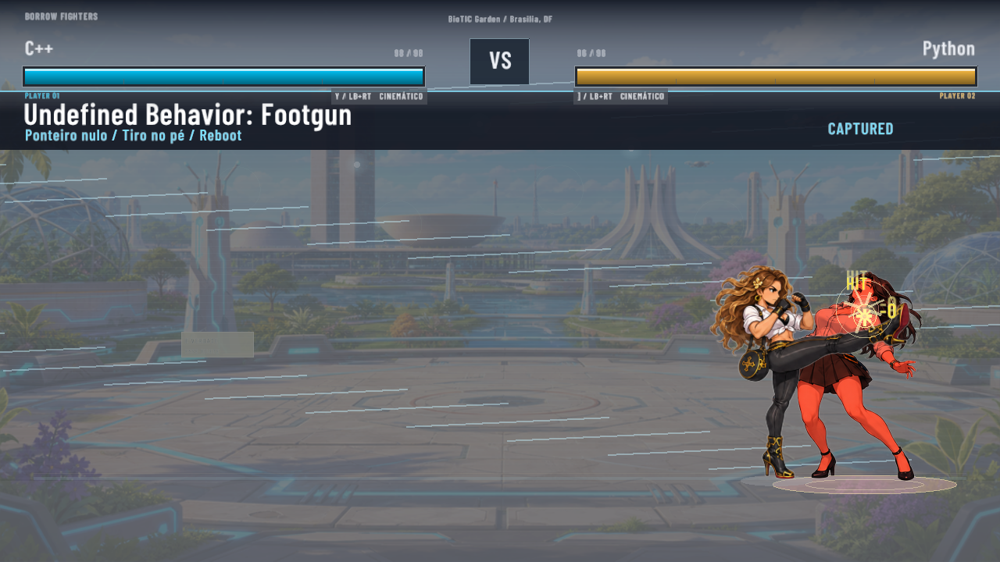

# Reações com dano desligado

[](../../../../assets/showcase/python-cpp-no-damage-2026-09-09.mp4)

[Vídeo da correção](../../../../assets/showcase/python-cpp-no-damage-2026-09-09.mp4):
13 segundos, 1280×720, 60 fps. A rajada começa em 6,73 s. Os dois flags de dano
estão desligados; a simulação usa `World::update_with_flags` e o renderer da
partida, `draw_fight`, recebe os mesmos flags. Arena BioTIC, C++ contra Python.

O problema estava no código: desligar dano também pulava a rotina de reação.
Os sprites da rodada anterior já estavam disponíveis. A correção preserva
somente HP e mantém o contato, inclusive defesa, empurrão, queda e áudio.

## Verificação

- [Registro de C++](cpp-review.json): HP inicial/final **98/98 e 96/96**.
  Os 80 ticks da rajada, de 344 a 423, mantêm `reaction_head` e hitstun ativo.
  Cada uma das oito pancadas reinicia no desenho 00 e percorre os quatro
  desenhos; nenhum frame dessa janela seleciona idle.
- Amostras conferidas: [impacto](cpp-kick-impact.png),
  [recuo três frames depois](cpp-kick-recoil.png) e
  [recomposição sete frames depois](cpp-kick-settle.png). `HIT -0` e as barras
  cheias permanecem visíveis enquanto Python articula cabeça, braços e tronco.
- [Registro de Python contra C++](python-review.json): HP **96/96 e 98/98**
  preservado. Aproximação, ocultação durante a deglutição, lançamento no retorno,
  [queda](python-super-fall.png) e recuperação continuam ativos.
- [Rust](rust-verification.json): **349 testes passaram**, zero falhas,
  um teste de dispositivo de áudio ignorado. Fmt e Clippy com todos os
  alvos/features aprovados. As três regressões novas cobrem proteção a 1 HP,
  chip zero, flags independentes, guarda, whiff, projétil, arremesso, lançamento,
  assinatura, supers e eventos sonoros.
- [Mídia](media-review.json): 782 frames H.264 e áudio AAC decodificados sem erro.
  O [áudio](offline-audio-mix.json) foi reconstruído offline dos eventos reais
  exportados; esta captura não afirma uma nova validação de dispositivo ao vivo.

As capturas usam display isolado e entradas determinísticas. Foram examinadas
as amostras corporais acima e a progressão registrada de todos os contatos;
isso não substitui o playtest humano de fluidez. Os JSONs preservam os nomes e
caminhos temporários originais para rastreabilidade; os quatro PNGs acima são
as imagens retidas, e as demais podem ser reproduzidas pelo exemplo.

## Reproduzir

```sh
cargo run --example capture_authored_super_review -- --character cpp --opponent python --arena biotic --no-damage --barrage-log --output /tmp/no-damage-cpp --video /tmp/no-damage-cpp-silent.mp4
cargo run --example capture_authored_super_review -- --character python --opponent cpp --arena biotic --no-damage --output /tmp/no-damage-python
python3 tools/audio/mix_authored_super_review.py --video /tmp/no-damage-cpp-silent.mp4 --events /tmp/no-damage-cpp/authored-super-review.json --output /tmp/no-damage-cpp-audio.mp4 --report /tmp/no-damage-audio.json
cargo test --test no_damage_reactions
```

O exemplo precisa de uma sessão gráfica; o mixer precisa de NumPy e FFmpeg.
No jogo, desligar `Player 1 recebe dano` e/ou `Player 2 recebe dano` em Options
deve conservar a vida e manter a resposta a cada golpe confirmado.
