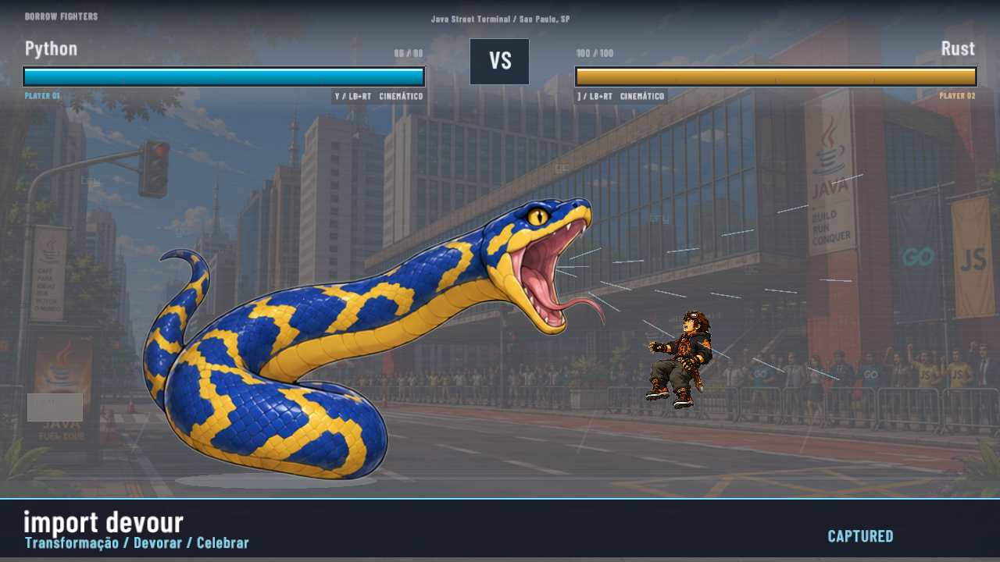

# Reações e transformações — entrega de 9 de setembro de 2026

Registro histórico de `caa3858`. O playtest seguinte rejeitou a leitura corporal
das reações, principalmente na rajada de C++. A validação abaixo não demonstrava
resposta convincente a cada pancada. O [piloto Python/C++ da rodada 25](../../25-python-cpp-contact-reactions.md)
substitui essa parte da apresentação e mede cada contato separadamente.

[](../../../assets/showcase/reactions-transformations-2026-09-09.mp4)

[Demonstração dos cinco supers com áudio](../../../assets/showcase/reactions-transformations-2026-09-09.mp4):
48 segundos, 1280×720, 60 fps. O World real controla captura, dano, reações e
mutação da arena. Os frames foram gravados em um display Xvfb isolado; a trilha
foi mixada offline a partir dos 80 eventos reais e do manifesto de áudio.
O AudioPlayer também foi testado separadamente no dispositivo real.

## Roteiros e imagens

| Super | Trecho no vídeo | Evidências | Dano / chip |
|---|---|---|---|
| Rust — Ownership Eclipse | 0–7,50 s | [Blocos de Sirius](rust-build.png), [troca efetiva](rust-sirius.png), [persistência após o super](rust-restored.png), [outro lado](rust-sirius-left.png). | 28 / 7 |
| Duke — Garbage Collector | 7,50–15,83 s | [Queda gigante e reação do defensor](duke-impact.png). | 32 / 8 |
| Old C — General Protection Fault | 15,83–23,67 s | [Retorno após o reboot](c-reboot.png). | 32 / 8 |
| C++ — Undefined Behavior: Footgun | 23,67–36,70 s | [Notebook e código legível](cpp-laptop.png), [tiro no pé](cpp-footshot.png), [rajada](cpp-barrage.png), [terminais](cpp-terminals.png), [BIOS](cpp-bios.png), [reboot](cpp-reboot.png). | 36 / 10 |
| Python — import devour | 36,70–48 s | [Transformação](python-morph.png), [boca](python-mouth.png), [bote](python-devour.png), [alvo engolido](python-swallowed.png), [salto](python-hop.png), [paz](python-peace.png). | 32 / 8 |

Os trechos incluem preparação e observação após cada sequência; as durações dos
golpes estão no [catálogo da rodada](../../24-reactions-and-transformations.md).
O banner da Python fica no rodapé para liberar a cabeça da cobra. Os subtítulos
descrevem o roteiro; o HUD identifica a arena efetiva da partida.

O [registro do vídeo](video-review.json) e a [passagem espelhada](reverse-review.json)
registram 144 snapshots de fases em dez execuções sem defesa. Foram preservados
22 PNGs sem retoque; `retained_image` aponta os selecionados. Os demais quadros
podem ser reproduzidos pelo exemplo. Também foram inspecionados o
[bote à esquerda](python-devour-left.png), o [salto à esquerda](python-hop-left.png),
o [tiro no pé espelhado](cpp-footshot-left.png) e a [BIOS espelhada](cpp-bios-left.png).
Na BIOS não aparecem HUD, arena ou lutadores.

A revisão visual abrangeu fases nos dois sentidos e amostras do MP4 a 10 fps
durante bote/deglutição e rajada. As transições preservam a identidade dos atores,
o alvo entra na boca antes de desaparecer e a rajada alterna golpes e reações.
Isso aprova a leitura deste slice; não representa balanceamento competitivo.

## Regras, áudio e controles

- [Verificação final](verification.json): `cargo fmt --all --check`, Clippy estrito
  com todos os alvos/features e `cargo test --all-targets` aprovados. **335 testes
  passaram, um de dispositivo foi ignorado na suíte padrão**, em 39 alvos.
- [Matriz de reações](reactions/README.md): 1.704 cenários com seis defensores,
  duas direções, vários golpes e colisão com/sem metadata. Inclui progressão de
  recoil, voo, queda, guarda e KO; Go reutiliza seus desenhos com transformação.
- [Guarda](guard-review.json): dez execuções completas confirmam chip de
  7/8/8/10/8 HP nos dois sentidos. Os testes cobrem piso de 1 HP, KO ao fim do
  roteiro, reset, alvo aéreo, captura e persistência/reset da arena.
- [Controles reais](controls/README.md): seis checks de Rust e dez de Python
  preservados da execução anterior ao reinício, com hashes dos binários usados.
  O acabamento posterior foi conferido nas capturas finais desta pasta.
- [AudioPlayer real](audio-stream-review.json): pausa, retomada, cancelamento,
  cues durante a pausa e troca Java Street → Sirius com cursor zero. Reset
  restaura a faixa original. O teste ignorado acima passou separadamente.
- [Procedência do áudio](audio-assets-review.json): dez efeitos novos válidos;
  vozes e bindings anteriores de Duke/Python preservados. O replay após interrupção
  reinicia a ordem dos sons do super e conserva a variação das vozes comuns.
- [Mixagem](offline-audio-mix.json) e [verificação de mídia](media-review.json):
  2.880 frames H.264, AAC estéreo 48 kHz, 80 cues sincronizados e cinco pausas de
  música; pico decodificado de aproximadamente −2,01 dBFS, sem clipping.
  A trilha do vídeo é uma reconstrução offline, não uma captura PulseAudio ao vivo.

## Reproduzir

Com Rust, as dependências nativas do jogo e uma sessão gráfica disponível:

```sh
cargo run --example capture_authored_super_review -- --arena java-street --both-sides --output /tmp/reactions-phases
cargo run --example capture_authored_super_review -- --arena java-street --guard --both-sides --no-snapshots --output /tmp/reactions-guard
cargo run --example capture_authored_super_review -- --arena java-street --no-snapshots --output /tmp/reactions-video --video /tmp/reactions-silent.mp4
python3 tools/audio/mix_authored_super_review.py --video /tmp/reactions-silent.mp4 --events /tmp/reactions-video/authored-super-review.json --output /tmp/reactions-audio.mp4 --report /tmp/reactions-audio-mix.json
```

O exemplo e o mixer recusam sobrescrever vídeos existentes. A mixagem exige
NumPy, ffmpeg e ffprobe. Para inspeção interativa, use
`cargo run -- --showcase --character python --move cinematic_special --repeat`;
troque `python` por `cpp`, `rust`, `duke` ou `c`.

O [registro de recuperação](recovery-2026-09-09.md) preserva o prompt original
e distingue o estado encontrado após o reinício da entrega final acima.
