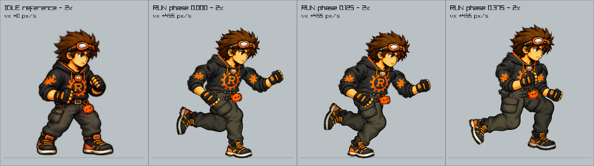

# Revisão nativa da corrida de Rust

O conjunto `before/` preserva a corrida recebida nesta rodada. O harness chama
o renderer real, com o mesmo ator, escala e física da aventura. Os arquivos
`protocol.json` registram hashes dos dados, arte e código usados na captura.

## Primeira captura e feedback

Primeira captura concluída com saída 0, 129 hashes estáveis e decodificação do
vídeo sem erro: 12 segundos, 720 quadros, 1280×900, 60 fps. A telemetria confirma
`delta_x = velocity_x / 60` em todos os ticks. Partida, parada e reversão mantêm
o relógio por distância; a direção acompanha a velocidade física.

Na revisão das folhas e dos quadros consecutivos, a nova calça conserva um
contorno contínuo no joelho. Tênis e sola permanecem reconhecíveis nas três
fases apontadas, e a oclusão breve de passagem não produz lacunas. Cabeça,
emblema, acessórios e escala continuam coerentes com idle. Os 12 PNGs de
caminhada/chute anteriores têm hashes idênticos ao baseline.

O usuário apontou um defeito em [transition-359](after/transition-359.png):
a orientação do tênis durante a recuperação não acompanhava a canela. `after/`
permanece intacto como referência. A versão `after-ankle/` gira a bota em torno
do tornozelo já resolvido, acompanhando a canela no voo e retornando gradualmente
à orientação de apoio. Quadril, joelho, tornozelo e apoios permanecem iguais.
Uma folha de oito fases inclui o quadro 359 e seu entorno, inspecionados nos
dois sentidos. A captura final `after-ankle/` terminou com saída 0, os mesmos
129 hashes antes/depois e vídeo de 12 segundos / 720 quadros / 60 fps sem erro
de decodificação. `timeline.csv` é idêntico ao da primeira captura: física,
fases e velocidade não mudaram. Os quadros 359–361 confirmam a continuidade
do ângulo; `before/` e `after/` foram preservados e conferidos por SHA-256.

| Revisão | Antes | Depois |
| --- | --- | --- |
| Idle + fases 0 / 0,125 / 0,375 | [Imagem](before/idle-and-reported-phases-right-2x.png) | [Imagem](after-ankle/idle-and-reported-phases-right-2x.png) |
| Ciclo completo à direita, 1x | [Imagem](before/phases-right-1x.png) | [Imagem](after-ankle/phases-right-1x.png) |
| Ciclo completo à esquerda, 1x | [Imagem](before/phases-left-1x.png) | [Imagem](after-ankle/phases-left-1x.png) |
| Movimento e transições | [Vídeo](before/start-stop-reverse-60fps.mp4) | [Vídeo](after-ankle/start-stop-reverse-60fps.mp4) |
| Ângulo do tênis no quadro 359 | [Primeira malha](after/transition-359.png) | [Correção](after-ankle/transition-359.png) |

[Prólogo](after-ankle/context-prologue-right-phase-0125.png) ·
[Capítulo](after-ankle/context-chapter-left-phase-0375.png) ·
[Recuperação do tornozelo](after-ankle/ankle-recovery-left-2x.png) ·
[Telemetria](after-ankle/timeline.csv) · [Protocolo](after-ankle/protocol.json).



## Reprodução

```sh
python3 docs/evidence/run-cycle-rebuild/capture.py --output /tmp/rust-run-review
```

O diretório de destino precisa estar vazio. Por padrão são capturadas 16 fases
em cada sentido, nas escalas 1x e 2x, uma comparação com idle para as fases
0 / 0,125 / 0,375, e um vídeo de 12 segundos a 60 fps. `--no-video` permite uma
verificação rápida de poses. Não executar enquanto outra tarefa modifica a
arte ou os arquivos do renderer: o protocolo detecta alteração dos hashes.

O vídeo exercita pausa inicial, aceleração, corrida, freio, retomada, reversão
e parada final. O `timeline.csv` registra posição, deslocamento, fase, ação,
direção e velocidade. As capturas de transição acompanham comandos e mudanças
efetivas de ação/direção. A linha inferior é o chão; as marcas do piso mostram
o deslocamento enquanto a câmera acompanha Rust.
Os 60 fps são a cadência de amostragem e do arquivo de vídeo, não uma medição
de desempenho da GPU durante gameplay.

O harness v2 acrescentou velocidade nominal nas folhas estáticas e métricas
de velocidade no vídeo. O baseline usou v1: sua corrida não consumia velocidade
no renderer, portanto suas poses estáticas permanecem representativas. O vídeo
do baseline já usava a física real. O baseline não foi refeito nem sobrescrito.
O v3 acrescenta duas capturas em 1280×720 com os renderizadores e câmeras reais:
prólogo à direita em fase 0,125 e capítulo à esquerda em fase 0,375. Os hashes
também abrangem os dados e as imagens de cenário usados nesses enquadramentos.
O v4 acrescenta oito fases de recuperação do tornozelo em 2x nos dois sentidos,
incluindo exatamente a fase 0,5742512 do quadro 359 apontado pelo usuário.

O ciclo em corrida usa interpolação. As fronteiras de estado idle/run e o giro
mantêm suas trocas diretas de pose existentes; não possuem clips de transição
novos nesta correção da anatomia.

## Critérios

- Tecido contínuo, com leitura de coxa, joelho e canela, sem pregas sobrepostas.
- Sola, ponta e calcanhar reconhecíveis; botas rígidas e proporcionais ao idle.
- Volume consistente nos dois sentidos e durante as fases de passagem.
- Cabeça e emblema preservados; ausência de lacunas nas articulações.
- Apoio sincronizado ao chão e continuidade do ciclo em movimento.

A captura bem-sucedida não equivale à aprovação visual. A
[documentação da reconstrução](../../37-run-cycle-rebuild.md) explica a técnica;
o [diário](../../worklogs/run-cycle-rebuild.md) registra os checkpoints.
